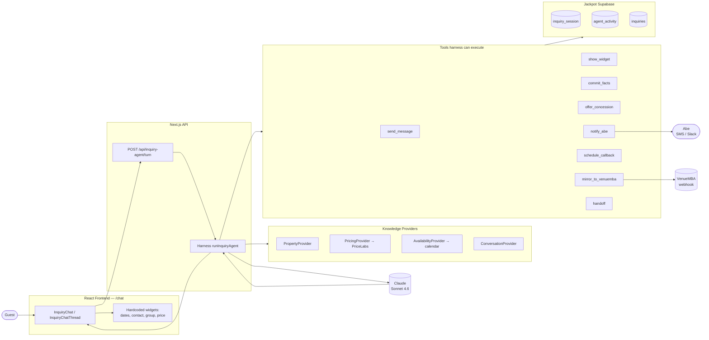
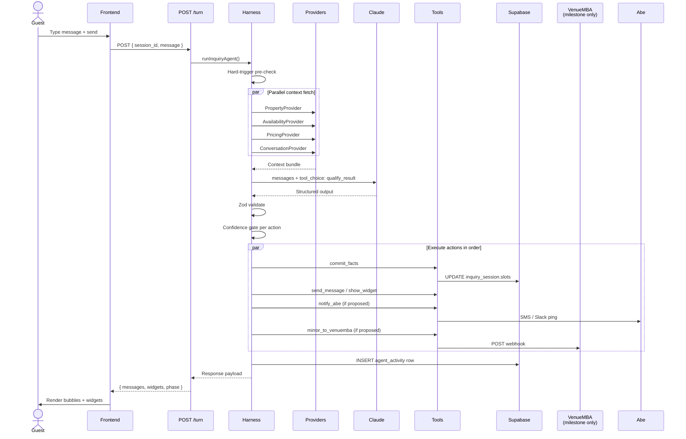
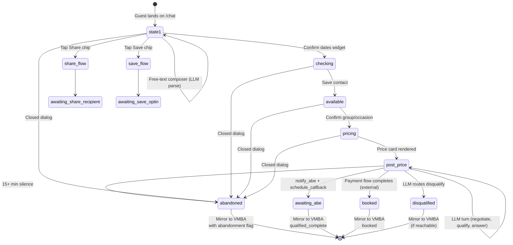

# Inquiry Agent — End-to-End Simulation

**Date:** 2026-06-05
**Companion to:** `docs/inquiry-agent-intel-brief-2026-06-05.md`
**Purpose:** Walk through one complete simulated inquiry — chat surface + backend + data flow + audit log — so the loop is concrete before any code is written.

---

## 0. What this is

A turn-by-turn simulation of a single guest's session from "lands on `/chat`" to "Abe is notified, VenueMBA is mirrored, session is closed." For every turn we show:

- **Surface** — what the guest sees on screen (chat bubbles + widgets)
- **Frontend** — the request fired by the React layer
- **Harness** — what runs server-side (LLM call, validation, tool execution)
- **State** — what changed in the database
- **Audit** — what got logged

Then an alt branch covers abandonment recovery and the mirror payload to VenueMBA.

This isn't the spec — `inquiry-agent-intel-brief-2026-06-05.md` is the spec. This is the *animation* of the spec running, so we can spot the gaps the spec didn't surface.

---

## 1. System overview



The headline pattern: **every guest message becomes one Claude call.** The harness assembles context, fires Claude with forced `tool_choice`, validates the structured output with Zod, and executes the proposed actions deterministically. Storage and side effects live in the harness, never in the LLM's prompt.

---

## 2. Components at a glance

| Layer | What it does | Lives at |
|-------|--------------|----------|
| **Frontend** | Renders chat surface; fires `POST /api/inquiry-agent/turn` per guest action | `src/components/brand/InquiryChat*.tsx` (existing) + small wire-up |
| **API route** | Receives turn, calls harness, streams response back | `src/app/api/inquiry-agent/turn/route.ts` (new) |
| **Harness** | Orchestrates context assembly → Claude call → validation → tool execution | `src/lib/inquiry-agent/harness.ts` (new) |
| **Providers** | Modular context — property facts, live pricing, calendar, conversation history | `src/lib/inquiry-agent/providers/` (new) |
| **Tools** | Deterministic action executors. LLM proposes; harness runs. | `src/lib/inquiry-agent/tools/` (new) |
| **Claude** | Single call per turn, forced `tool_choice: qualify_result`, returns structured output | Anthropic API |
| **Storage** | `inquiry_session` (live state), `agent_activity` (audit log), `inquiries` (committed leads) | Jackpot Supabase |
| **VMBA mirror** | One-way webhook POST at milestones | `VENUEMBA_WEBHOOK_URL` (existing) |

---

## 3. The scenario: Sarah

Sarah is planning a bachelorette weekend for her best friend Mia. Twelve girls, Memorial Day weekend, looking at three or four other group homes in Chicago. She found The Jackpot via Instagram and lands on `/chat` on her phone at **3:14pm Friday, May 8, 2026**.

We're going to walk through her session end-to-end. Two outcomes will be shown:
- **Main branch:** She negotiates a mid-week shift, accepts, hands off to Abe.
- **Alt branch:** She goes silent at the price reveal. The system mirrors to VenueMBA for SMS follow-up.

---

## 4. Turn-by-turn walkthrough (main branch)

### Turn 0 — Landing

#### Surface

Sarah lands on `/chat`. She sees the brand hero + the InquiryChat card:

```
┌──────────────────────────────────────────────┐
│  ⓞ  Olivia                                   │
│      ● Active 2 min ago                      │
├──────────────────────────────────────────────┤
│  Browsing for the group? I can help, or just │
│  send you what you need.                     │
│                                              │
│  [ Check dates & price        → ]            │
│  [ Send this to my group      → ]            │
│  [ Save for later             → ]            │
├──────────────────────────────────────────────┤
│  Or ask anything…                       ↑   │
└──────────────────────────────────────────────┘
```

#### Frontend
Nothing fired yet — just the static card rendered.

#### Harness
Nothing yet.

#### State
No `inquiry_session` row exists yet.

---

### Turn 1 — Free-text composer parse *(LLM kicks in here for the first time)*

#### Surface

Sarah skips the chips and types into the composer: **"memorial day weekend, 12 girls for a bachelorette"**

She taps send. Composer clears. Typing-dots bubble appears beneath Olivia's greeting.

#### Frontend

```http
POST /api/inquiry-agent/turn
Content-Type: application/json

{
  "session_id": null,
  "message": {
    "role": "user",
    "body": "memorial day weekend, 12 girls for a bachelorette",
    "ts": "2026-05-08T20:14:11Z"
  },
  "client_context": {
    "phase": "state1",
    "slots": {},
    "viewport": "mobile",
    "utm": { "source": "instagram", "medium": "story" }
  }
}
```

#### Harness

1. **Create session.** No `session_id` → insert a new `inquiry_session` row with `agent_state = {}`. Return new session_id.
2. **Assemble context.** Run all providers in parallel:
   - `PropertyProvider` — returns the fact sheet (sleeps 14, 5 bedrooms, cinema, hot tub, bar, etc.)
   - `AvailabilityProvider` — checks Memorial Day weekend, returns `{ available: true, range: '2026-05-22 to 2026-05-25' }`
   - `ConversationProvider` — empty (first turn)
3. **Hard-trigger pre-check.** Regex against `"talk to abe" | "cancel" | "stop" | "unsubscribe"` — no match, proceed to LLM.
4. **Call Claude.** Single call with system prompt + context + Sarah's message + `tool_choice: { type: 'tool', name: 'qualify_result' }`.

**Claude's structured output:**

```json
{
  "summary_for_human": "Sarah (no last name yet) typed free-text inquiry for Memorial Day weekend, 12 girls bachelorette. Parsed dates and group with high confidence. Good fit.",
  "extracted_slots": {
    "arrival": "2026-05-22",
    "departure": "2026-05-25",
    "group_size_band": "12-14",
    "occasion": "bachelorette",
    "confidence": {
      "overall": 0.92,
      "arrival": 0.88,
      "departure": 0.88,
      "group_size_band": 0.95,
      "occasion": 0.99
    }
  },
  "signals": {
    "stage": "mid",
    "urgency": "medium",
    "fit": "good",
    "complexity": "low",
    "sentiment": "positive",
    "intent": "info_request",
    "objections": [],
    "next_question_key": "contact",
    "reasoning": "Free-text inquiry parsed cleanly. Memorial Day = May 22-25. Twelve girls fits 12-14 band. Bachelorette is explicit. No friction yet."
  },
  "routing": {
    "next_step": "more_info",
    "reason": "Pre-fill widgets; advance to contact step",
    "should_handoff": false
  },
  "next_message": {
    "body": "Got it — Memorial Day weekend, twelve girls, bachelorette. Locked those in. Quick check before I pull a real number — what's the best way to reach you?",
    "widgets_to_show": ["dates_confirm", "contact_form_after_confirm"]
  },
  "agent_state_patch": {
    "phase": "state1_to_checking",
    "asked_keys": ["contact"],
    "last_routing": "more_info"
  },
  "actions": [
    {
      "tool": "commit_facts",
      "input": {
        "slots": {
          "arrival": "2026-05-22",
          "departure": "2026-05-25",
          "group_size_band": "12-14",
          "occasion": "bachelorette"
        }
      },
      "confidence": 0.92,
      "rationale": "All four slots parsed with >0.85 confidence"
    },
    {
      "tool": "show_widget",
      "input": {
        "widget": "dates_confirm",
        "payload": { "arrival": "2026-05-22", "departure": "2026-05-25" }
      },
      "confidence": 0.92
    },
    {
      "tool": "send_message",
      "input": { "body": "Got it — Memorial Day weekend, twelve girls, bachelorette. Locked those in. Quick check before I pull a real number — what's the best way to reach you?" },
      "confidence": 0.95
    }
  ],
  "overall_confidence": 0.92
}
```

5. **Validate.** Zod parse → pass.
6. **Gate by confidence.** All three actions ≥ their thresholds (0.65 for `commit_facts`, 0.70 for `show_widget`, 0.75 for `send_message`).
7. **Execute in order:**
   - `commit_facts` → `UPDATE inquiry_session SET slots = jsonb_set(...) WHERE id = ?`
   - `show_widget` → bundled in response payload to frontend
   - `send_message` → bundled in response payload to frontend
8. **Log to `agent_activity`.** One row: full Claude input + output + latency + token count + status `success`.

#### Response back to frontend

```json
{
  "session_id": "sess_01HXYZ",
  "phase": "state1_to_checking",
  "messages": [{ "role": "olivia", "body": "Got it — Memorial Day weekend...", "ts": "..." }],
  "widgets": [
    { "type": "dates_confirm", "payload": { "arrival": "2026-05-22", "departure": "2026-05-25" } }
  ]
}
```

#### Surface (now)

The chat updates:

```
                        ┌────────────────────────────────────┐
                        │ memorial day weekend, 12 girls     │← user bubble
                        │ for a bachelorette                 │
                        └────────────────────────────────────┘

 ⓞ  Got it — Memorial Day weekend, twelve
     girls, bachelorette. Locked those in.
     Quick check before I pull a real number —
     what's the best way to reach you?

     ┌──────────────────────────────────────┐
     │ Wed May 22 → Fri May 25              │
     │ Looks right        Edit              │
     └──────────────────────────────────────┘
```

#### State now

`inquiry_session.slots`:
```json
{
  "arrival": "2026-05-22",
  "departure": "2026-05-25",
  "group_size_band": "12-14",
  "occasion": "bachelorette"
}
```

`agent_activity` rows: 1 (this turn).

---

### Turn 2 — Sarah confirms dates *(no LLM call — deterministic)*

#### Surface

Sarah taps **"Looks right"** on the dates-confirm widget. The widget collapses into a compact user bubble:

```
                                          ┌──────────────────────┐
                                          │ Wed May 22 → May 25  │
                                          └──────────────────────┘
```

The contact-form widget fades in below.

#### Frontend

```http
POST /api/inquiry-agent/turn

{
  "session_id": "sess_01HXYZ",
  "message": {
    "role": "user",
    "body": "[CONFIRM:dates]",
    "ts": "..."
  },
  "client_context": { "phase": "state1_to_checking", "slots": {...} }
}
```

#### Harness

Widget confirmations are **deterministic — no LLM call.** The harness:

1. Validates the `[CONFIRM:dates]` token matches the active widget.
2. Re-runs `AvailabilityProvider` to double-check (catches the race condition where the calendar changed since turn 1).
3. Transitions `phase` to `checking`.
4. Returns the contact form widget.

No `agent_activity` row (this isn't a Claude call). One small `session_events` row capturing the widget confirmation, for debugging.

#### State now

`inquiry_session.phase = "checking"` — slots unchanged.

---

### Turn 3 — Contact form *(no LLM call — deterministic)*

#### Surface

Sarah fills the form:

```
 ┌──────────────────────────────────────┐
 │  NAME       Sarah Chen               │
 │  EMAIL      sarah.chen@email.com     │
 │  PHONE      (312) 555-0142           │
 │                                      │
 │       [ Save my info ]               │
 └──────────────────────────────────────┘
```

Taps "Save my info." Widget collapses. Sage success line appears: `✓ Got it — the answer will land in your inbox too.`

#### Frontend

```http
POST /api/inquiry-agent/turn

{
  "session_id": "sess_01HXYZ",
  "message": {
    "body": "[COMMIT:contact]",
    "payload": { "name": "Sarah Chen", "email": "sarah.chen@email.com", "phone": "+13125550142" }
  }
}
```

#### Harness

Still deterministic. The harness:
1. Lightly validates the email + phone server-side.
2. Writes `name`, `email`, `phone` to `inquiry_session.slots`.
3. Transitions `phase` to `available`.
4. Pre-fills the group/occasion widget from prior slots (already filled in turn 1 — show as confirmation).
5. Returns: confirmation success line + the group/occasion widget pre-filled.

#### State now

`inquiry_session.slots`:
```json
{
  "arrival": "2026-05-22",
  "departure": "2026-05-25",
  "group_size_band": "12-14",
  "occasion": "bachelorette",
  "name": "Sarah Chen",
  "email": "sarah.chen@email.com",
  "phone": "+13125550142"
}
```

---

### Turn 4 — Group/occasion confirm *(no LLM call — deterministic)*

Sarah sees the group/occasion widget pre-filled with `12-14` and `Bachelorette`. She taps **"Continue"**. Widget collapses.

`phase` transitions to `pricing`. Harness calls `PricingProvider` to get the actual number from PriceLabs.

---

### Turn 5 — Price reveal *(scripted Olivia bubble; LLM activates after)*

#### Surface

The pricing pill ("Pulling pricing now…") spins for ~2 seconds while PriceLabs returns. Then the price card lands:

```
 ┌──────────────────────────────────────┐
 │  YOUR WEEKEND                        │
 │                                      │
 │  Wed May 22 → Fri May 25             │
 │  3 nights · 12–14 guests             │
 │                                      │
 │  ─────────────────                   │
 │                                      │
 │     $2,400  /  nightly subtotal      │
 │       $150  /  cleaning              │
 │       $250  /  taxes                 │
 │  ─────────────────                   │
 │     $2,800  /  total                 │
 │       $233  /  per person            │
 │                                      │
 │  [ Lock in dates    →  ]             │
 │  [ Send to my group →  ]             │
 │  [ Have Abe text me →  ]             │
 └──────────────────────────────────────┘

 ⓞ  There's your number. How does it sit?
```

The Olivia bubble after the card is the **first LLM turn of the post-price phase.** From here on every guest message goes through a Claude call.

#### Backend mechanics

The price card render is deterministic — `PricingProvider` returns numbers, harness shows the widget. The follow-up Olivia bubble is generated by an LLM call with no guest message yet (`message: null`, `trigger: 'price_revealed'`). This gives Olivia voice flexibility instead of a scripted line, but stays low-stakes since it's just an opener.

---

### Turn 6 — Sarah pushes back

#### Surface

Sarah types: **"honestly that's a bit steep for us. can you do anything?"**

#### Frontend

```http
POST /api/inquiry-agent/turn

{
  "session_id": "sess_01HXYZ",
  "message": { "body": "honestly that's a bit steep for us. can you do anything?", "ts": "..." }
}
```

#### Harness

1. Hard-trigger check — no match.
2. Assemble context. `ConversationProvider` now has 5 prior turns. `PricingProvider` returns same price. `PropertyProvider` unchanged.
3. Call Claude.

**Claude's structured output (compact):**

```json
{
  "extracted_slots": {
    "price_response": "too_high",
    "objections": ["price too high for the group"],
    "confidence": { "overall": 0.94, "price_response": 0.93 }
  },
  "signals": {
    "stage": "mid",
    "urgency": "medium",
    "fit": "good",
    "sentiment": "neutral",
    "intent": "pricing_negotiation",
    "objections": ["price too high"],
    "next_question_key": "date_flexibility"
  },
  "routing": {
    "next_step": "clarify",
    "reason": "Pushback on price. Probe for date flexibility before offering concession.",
    "should_handoff": false
  },
  "next_message": {
    "body": "Heard. Two levers I can pull — your dates have any give, or want me to strip the add-ons and see where the floor lands?"
  },
  "actions": [
    { "tool": "commit_facts", "input": {...}, "confidence": 0.93 },
    { "tool": "send_message", "input": {...}, "confidence": 0.91 }
  ],
  "overall_confidence": 0.92
}
```

4. Execute. `commit_facts` updates `slots.price_response = 'too_high'`. `send_message` returns the bubble.

#### Surface

```
 ⓞ  Heard. Two levers I can pull — your dates
     have any give, or want me to strip the
     add-ons and see where the floor lands?
```

---

### Turn 7 — Sarah offers flex

#### Surface

Sarah: **"could shift to weekday if it helps"**

#### Harness

**Claude's structured output:**

```json
{
  "extracted_slots": {
    "date_flexibility": "mid_week",
    "confidence": { "overall": 0.91, "date_flexibility": 0.94 }
  },
  "signals": {
    "intent": "date_flex_probe",
    "sentiment": "positive",
    "fit": "good"
  },
  "routing": {
    "next_step": "concession_offer",
    "reason": "Guest opened date flexibility. Mid-week shift unlocks ~30% price drop. Show concession card."
  },
  "next_message": {
    "body": "Good — Wed to Sat brings it to $1,950 total. Same home, same crew, $850 saved. Want me to lock those dates?"
  },
  "actions": [
    { "tool": "commit_facts", "input": { "slots": { "date_flexibility": "mid_week" } }, "confidence": 0.94 },
    {
      "tool": "offer_concession",
      "input": {
        "type": "midweek_shift",
        "current": { "arrival": "2026-05-22", "departure": "2026-05-25", "total_cents": 280000 },
        "alt": { "arrival": "2026-05-20", "departure": "2026-05-23", "total_cents": 195000 }
      },
      "confidence": 0.88
    },
    { "tool": "show_widget", "input": { "widget": "concession_card", "payload": {...} }, "confidence": 0.88 },
    { "tool": "send_message", "input": {...}, "confidence": 0.92 }
  ],
  "overall_confidence": 0.90
}
```

Important: **the price values come from `PricingProvider`, not Claude.** The `offer_concession` tool internally re-prices the alt dates via PriceLabs before populating the widget. Claude only *proposes* the concession; the harness materializes it with real numbers.

#### Surface

```
 ⓞ  Good — Wed to Sat brings it to $1,950
     total. Same home, same crew, $850 saved.
     Want me to lock those dates?

 ┌──────────────────────────────────────┐
 │  MID-WEEK SHIFT                      │
 │                                      │
 │  Wed May 20 → Sat May 23             │
 │  Same 3 nights, same home            │
 │                                      │
 │  $2,800  →  $1,950   (save $850)     │
 │  $233    →  $163    /per person      │
 │                                      │
 │  [ Lock in the new dates  →  ]       │
 │  [ Keep the original      →  ]       │
 └──────────────────────────────────────┘
```

---

### Turn 8 — Sarah accepts

#### Surface

Sarah taps **"Lock in the new dates"** on the concession card.

#### Frontend

```http
POST /api/inquiry-agent/turn

{
  "session_id": "sess_01HXYZ",
  "message": { "body": "[ACCEPT:concession_midweek_shift]", "ts": "..." }
}
```

#### Harness

Concession acceptance *does* go through Claude — the model needs to compose the close and decide routing.

**Claude's structured output:**

```json
{
  "extracted_slots": {
    "price_response": "happy",
    "confidence": { "overall": 0.96, "price_response": 0.96 }
  },
  "signals": {
    "stage": "late",
    "urgency": "high",
    "intent": "book",
    "sentiment": "positive"
  },
  "routing": {
    "next_step": "callback_schedule",
    "reason": "Guest accepted concession. Ready to book. Hand off to Abe within 10 min per the support pattern.",
    "should_handoff": false,
    "handoff_priority": "high",
    "should_mirror_to_venuemba": true,
    "mirror_reason": "qualified_complete"
  },
  "next_message": {
    "body": "Locked. Abe will text you in the next ten minutes — he handles the last step. Sit tight."
  },
  "actions": [
    {
      "tool": "commit_facts",
      "input": {
        "slots": {
          "arrival": "2026-05-20",
          "departure": "2026-05-23",
          "price_response": "happy",
          "concession_accepted": "midweek_shift"
        }
      },
      "confidence": 0.96
    },
    {
      "tool": "notify_abe",
      "input": {
        "reason": "Guest accepted mid-week concession. Bachelorette, Sarah Chen, Wed May 20 → Sat May 23. Locked at $1,950. Ready to book.",
        "transcript_url": "https://thejackpotchicago.com/admin/sessions/sess_01HXYZ",
        "urgency": "high",
        "preferred_channel": "sms"
      },
      "confidence": 0.94
    },
    {
      "tool": "schedule_callback",
      "input": { "delay_min": 10, "channel": "sms", "to_phone": "+13125550142" },
      "confidence": 0.88
    },
    {
      "tool": "mirror_to_venuemba",
      "input": {
        "event": "qualified_complete",
        "session_id": "sess_01HXYZ"
      },
      "confidence": 0.92
    },
    { "tool": "send_message", "input": {...}, "confidence": 0.95 }
  ],
  "overall_confidence": 0.93
}
```

Execution order matters here:

1. `commit_facts` first — slots locked in DB.
2. `notify_abe` — Slack/SMS goes out to Abe with the session URL.
3. `schedule_callback` — queues the "Abe should text Sarah in 10 min" reminder.
4. `mirror_to_venuemba` — fires the webhook with the full session snapshot (see §7 below).
5. `send_message` — Olivia's final reply renders.

If `mirror_to_venuemba` fails (webhook timeout, signature mismatch), the harness logs the failure and surfaces it to Abe via `notify_abe` — never half-mirrors.

#### Surface (final state)

```
                        ┌──────────────────────────────────────┐
                        │ Lock in the new dates                │
                        └──────────────────────────────────────┘

 ⓞ  Locked. Abe will text you in the next ten
     minutes — he handles the last step.
     Sit tight.

 ┌──────────────────────────────────────┐
 │  ⓞ  Abe is on it                     │
 │      He'll text +1 (312) 555-0142    │
 │      in the next 10 minutes.         │
 └──────────────────────────────────────┘
```

#### State now

`inquiry_session` is in a terminal-ish state: `phase = 'awaiting_abe'`, all slots filled, audit log shows 5 Claude calls + 3 deterministic widget commits.

---

## 5. Sequence diagram for a single LLM turn

The shape of every LLM turn (turns 1, 5, 6, 7, 8 in the walkthrough) is the same:



Every Claude call produces exactly one `agent_activity` row regardless of how many actions were proposed. That row is the single source of truth for replay and debugging.

---

## 6. State machine across a session

Every `inquiry_session` row carries a `phase` field that tracks where the conversation is. The states and transitions:



A few things this state machine surfaces that the brief didn't:

- **Share and Save chips have their own sub-flows** — they don't move through the standard `dates → contact → group → price` linear path. Worth designing.
- **`abandoned` is reachable from every step** — we need a sweep job that catches "guest closed dialog and never came back," not just "guest went silent post-price."
- **`disqualified` is rare but real** — the LLM might decide a guest isn't a fit (party-house vibe, group too big, etc.) and route to disqualify. We need to design what that path looks like — a kind closeout, not a hard wall.

---

## 7. The data record after Sarah's session

After turn 8, here's what lives in the Jackpot Supabase:

### `inquiry_session` row

```json
{
  "id": "sess_01HXYZ",
  "created_at": "2026-05-08T20:14:11Z",
  "last_activity_at": "2026-05-08T20:19:47Z",
  "phase": "awaiting_abe",
  "utm": { "source": "instagram", "medium": "story" },
  "slots": {
    "arrival": "2026-05-20",
    "departure": "2026-05-23",
    "nights": 3,
    "group_size_band": "12-14",
    "occasion": "bachelorette",
    "name": "Sarah Chen",
    "email": "sarah.chen@email.com",
    "phone": "+13125550142",
    "price_response": "happy",
    "date_flexibility": "mid_week",
    "concession_accepted": "midweek_shift",
    "objections": ["price too high"],
    "confidence": { "overall": 0.93, "...": "..." }
  },
  "signals": {
    "stage": "late",
    "urgency": "high",
    "fit": "good",
    "sentiment": "positive",
    "intent": "book"
  },
  "transcript": [
    { "role": "user", "body": "memorial day weekend, 12 girls for a bachelorette", "ts": "..." },
    { "role": "olivia", "body": "Got it — Memorial Day weekend, twelve girls, bachelorette...", "ts": "...", "widget": "dates_confirm" },
    { "role": "user", "body": "[CONFIRM:dates]", "ts": "..." },
    { "role": "user", "body": "[COMMIT:contact]", "ts": "..." },
    { "role": "olivia", "body": "There's your number. How does it sit?", "ts": "...", "widget": "price_card" },
    { "role": "user", "body": "honestly that's a bit steep for us. can you do anything?", "ts": "..." },
    { "role": "olivia", "body": "Heard. Two levers I can pull...", "ts": "..." },
    { "role": "user", "body": "could shift to weekday if it helps", "ts": "..." },
    { "role": "olivia", "body": "Good — Wed to Sat brings it to $1,950...", "ts": "...", "widget": "concession_card" },
    { "role": "user", "body": "[ACCEPT:concession_midweek_shift]", "ts": "..." },
    { "role": "olivia", "body": "Locked. Abe will text you in the next ten minutes...", "ts": "..." }
  ],
  "inquiry_id": null
}
```

The `inquiry_id` stays null until Abe actually closes the deal and the booking flow promotes this session into the `inquiries` table.

### `agent_activity` rows

One row per Claude call. After Sarah's session, 5 rows exist:

| turn | skill | trigger | latency_ms | input_tokens | output_tokens | overall_confidence | status |
|------|-------|---------|------------|--------------|---------------|-------------------|--------|
| 1 | inquiry | free_text | 1840 | 2,140 | 480 | 0.92 | success |
| 5 | inquiry | price_revealed | 1210 | 2,380 | 220 | 0.90 | success |
| 6 | inquiry | guest_message | 1660 | 2,510 | 410 | 0.92 | success |
| 7 | inquiry | guest_message | 2080 | 2,610 | 540 | 0.90 | success |
| 8 | inquiry | concession_accept | 1920 | 2,710 | 620 | 0.93 | success |

Each row contains the full Claude input + structured output so the entire conversation can be replayed for debugging or fine-tuning.

### Mirror payload sent to VenueMBA

At turn 8, `mirror_to_venuemba` fires with this body:

```json
{
  "source": "jackpot",
  "event": "qualified_complete",
  "session_id": "sess_01HXYZ",
  "inquiry_id": null,
  "contact": {
    "name": "Sarah Chen",
    "email": "sarah.chen@email.com",
    "phone": "+13125550142"
  },
  "property_context": {
    "name": "The Jackpot Chicago",
    "capacity": 14
  },
  "slots": {
    "arrival": "2026-05-20",
    "departure": "2026-05-23",
    "nights": 3,
    "group_size_band": "12-14",
    "occasion": "bachelorette",
    "price_response": "happy",
    "date_flexibility": "mid_week",
    "concession_accepted": "midweek_shift",
    "final_quoted_total_cents": 195000
  },
  "signals": {
    "stage": "late",
    "urgency": "high",
    "fit": "good",
    "sentiment": "positive",
    "intent": "book",
    "objections": ["price too high"]
  },
  "transcript": [/* full transcript array */],
  "agent_activity_summary": {
    "turn_count": 5,
    "last_routing": "callback_schedule",
    "objections": ["price too high"],
    "concessions_offered": ["midweek_shift"],
    "concessions_rejected": [],
    "handoff_reason": "qualified_complete + callback scheduled"
  },
  "abe_callback": {
    "scheduled_for": "2026-05-08T20:29:47Z",
    "channel": "sms",
    "to_phone": "+13125550142"
  },
  "signed_at": "2026-05-08T20:19:47Z",
  "signature": "hmac-sha256(VENUEMBA_WEBHOOK_SECRET, body)"
}
```

VenueMBA's SMS agent reads this and decides whether to layer its own follow-up SMS on top (e.g., a backup nudge if Abe doesn't text within 12 minutes). Jackpot doesn't read back; one-way write.

---

## 8. Alt branch — abandonment

Replay from turn 5. Sarah sees the price card. Olivia says "How does it sit?" Sarah closes the tab.

Nothing happens for 15 minutes.

A cron job (or a `setTimeout`-style queue, depending on infra) wakes up and queries:

```sql
SELECT id FROM inquiry_session
WHERE phase NOT IN ('awaiting_abe', 'booked', 'abandoned', 'disqualified')
  AND last_activity_at < NOW() - INTERVAL '15 minutes'
```

For each row returned, the harness fires a final action **without a Claude call** (this is a deterministic mirror, not a conversation turn):

```http
POST $VENUEMBA_WEBHOOK_URL

{
  "source": "jackpot",
  "event": "abandonment",
  "session_id": "sess_01HXYZ",
  "abandoned_at_phase": "post_price",
  "abandoned_at_ts": "2026-05-08T20:30:11Z",
  "contact": { "name": "Sarah Chen", "email": "...", "phone": "+13125550142" },
  "slots": { /* whatever was filled */ },
  "signals": { /* last known */ },
  "transcript": [ /* full transcript up to the silence */ ],
  "agent_activity_summary": {
    "turn_count": 2,
    "last_routing": "more_info",
    "last_olivia_message": "There's your number. How does it sit?",
    "abandonment_context": "Guest went silent immediately after price reveal. Last quoted: $2,800 total."
  }
}
```

Then `inquiry_session.phase = 'abandoned'`.

VenueMBA's SMS agent receives this. Based on the abandonment context (silence right after price), it might queue a low-key follow-up text to Sarah's number in 2 hours:

> "Hey Sarah — Olivia at the Jackpot. Saw you were checking dates for Memorial Day weekend. Sometimes the price lands easier with a bit more context — want me to text you a quick walkthrough of what's included?"

That's VenueMBA's call to make, with VenueMBA's own qualify-skill logic. Jackpot's job ended at the mirror.

---

## 9. Edge cases the simulation exposes

Things that came up while writing this walkthrough that aren't in the brief:

1. **What if Claude returns invalid structured output?** Zod parse fails → log raw output → fire `notify_abe` with "harness failed on session X" → render a fallback Olivia message ("Hmm, lost my place — give me a second?") → don't execute any actions. Never half-mirror.

2. **What if `PricingProvider` (PriceLabs) fails mid-session?** The price card can't render. Options: (a) retry once, then fallback to scripted "Let me check with Abe" + `notify_abe`, (b) cache last known good price in the session. Worth deciding.

3. **What if availability changes between turn 1 and turn 4?** Sarah parsed Memorial Day weekend at 3:14pm. At 3:18pm someone else books those dates. When she clicks "Continue" at turn 4, the harness re-checks `AvailabilityProvider` — and finds her dates are now gone. The flow has to gracefully degrade: "Those dates just got snapped up — let me show you the closest alternatives." This is essentially the unbuilt "availability = false branch" from the original brief §8.6.

4. **What if a guest types something offensive or abusive?** The hard-trigger pre-check should include this. Match offensive content → skip Claude → render "Let's keep it kind. Want to start over?" + log incident.

5. **What if Sarah refreshes her browser mid-session?** Session state is in Supabase, but her browser doesn't know `session_id` unless we persist it. Solution: cookie-based session token. Open question whether to bake this in stage 1 or accept "refresh resets you."

6. **What if Sarah comes back the next day?** Same email + phone in `inquiries` or `inquiry_session` history → returning visitor signal. But per brief §10.2, we punted this to stage 2.

7. **What if the LLM proposes a concession with confidence below threshold?** Currently the harness gates per action. If `offer_concession.confidence = 0.65` (below the 0.75 threshold), the action becomes a *draft* — visible to Abe in the admin but not auto-executed. The guest sees the bubble Olivia composed but no concession widget. Worth a UX call.

8. **Mirror retries.** If VenueMBA's webhook returns 500 on the qualified_complete mirror, do we retry? Exponential backoff? Or fire-and-forget and rely on a daily reconciliation cron? VenueMBA's read pattern (per their analysis doc) handles re-mirrors idempotently keyed on `session_id`.

---

## 10. What this simulation reveals (open design questions)

Beyond the five from the intel brief's §10, the simulation surfaced:

1. **Widget confirmation tokens.** I sketched `[CONFIRM:dates]`, `[COMMIT:contact]`, `[ACCEPT:concession_midweek_shift]` as the message bodies the frontend sends. Real spec needs to lock this format — they end up in `transcript` history and ideally read cleanly for debugging.

2. **Where the LLM-generated price-reveal bubble lives.** Turn 5's "There's your number. How does it sit?" came from a Claude call with no guest message. Worth deciding whether all such "trigger-based" bubbles run through Claude or have a hardcoded fallback for cost / latency.

3. **The Share and Save chip sub-flows.** State machine shows them as branches, but their internal flows aren't designed. They're stage-1 candidates per the reframe — but need their own turn-by-turn walkthrough before code.

4. **Disqualify flow.** Surfaced in the state machine, not designed. The LLM might decide a guest is a no-fit (group too rowdy from signals, occasion mismatch, etc.) — what does that closing message look like? Does it mirror to VMBA? Probably not.

5. **Abandonment threshold tuning.** 15 minutes is a guess. Could be 10, could be 30. Whatever it lands at, it should be configurable not hardcoded.

6. **Reconciliation between `inquiry_session` and `inquiries`.** When Abe closes Sarah's deal, who writes the `inquiries` row — the payment flow, the harness, or a separate "promote session to inquiry" job? The `inquiry_id` field needs an owner.

7. **Cost ceiling.** 5 Claude calls per session at ~$0.02 each = $0.10/session. At 100 inquiries/month that's $10/month — fine. At 10,000/month it's $1,000/month — different conversation. Worth modeling before scale.

---

## See also

- `docs/inquiry-agent-intel-brief-2026-06-05.md` — the spec this simulation animates
- `docs/inquiry-chat-brief-2026-05-20.md` — the UX flow this builds on
- `docs/venuemba-harness-analysis-2026-05-20.md` — the architecture pattern borrowed
- `brand/docs/design-system.md` — voice rules (every Olivia line in this doc obeys these)
- VMBA repo `apps/web/lib/ai/agent/skills/qualify.ts` — the original `qualify_result` schema this adapted from
